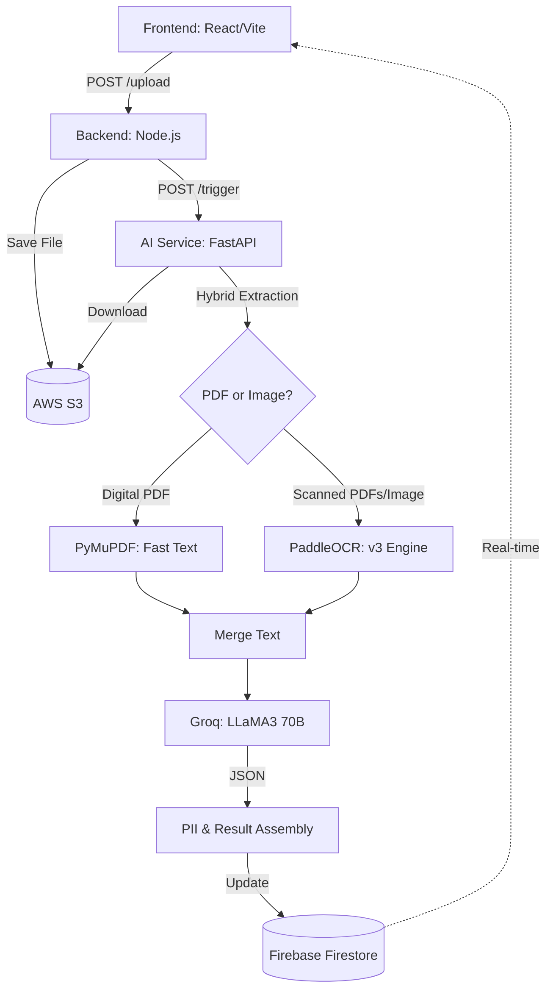

# DocuAI - Intelligent Document Processor

DocuAI is a powerful, multi-service application designed to process and analyze identity documents (like Passports and ID cards) using AI. It features a hybrid extraction pipeline that automatically switches between direct digital text extraction and high-precision OCR (Optical Character Recognition) for scanned images.

## 🚀 Key Features

- **Hybrid Extraction Pipeline**: Seamlessly handles both digital PDFs and scanned images/photos.
- **AI-Powered Structured Data**: Uses **Groq (LLaMA 3 70B)** to extract structured JSON data (Name, DOB, ID Number) from unstructured text.
- **PII Detection**: Automatically scans for and identifies Personally Identifiable Information (PII) to ensure data privacy.
- **Real-time Monitoring**: Built-in status tracking and real-time updates via Firebase Firestore.
- **Robust Hosting Support**: Optimized for Docker-based deployment (Render, AWS, etc.) with health checks and safety timeouts.

## 🏗️ Architecture & Data Flow

The system follows a decoupled, event-driven architecture to ensure high performance and reliability.

### System Overview


### How it Works (The Hybrid Pipeline)

1.  **Ingestion & Storage**: Files are uploaded through the React frontend to the Node.js backend, which securely stores them in an **AWS S3** bucket and creates a "Processing" record in **Firestore**.
2.  **Smart Routing**: The AI Service identifies the file type:
    *   **Direct Path**: For digital PDFs, it uses `PyMuPDF` to extract the text layer instantly.
    *   **OCR Path**: For images and scanned PDFs, it triggers the **PaddleOCR** engine (optimized for CPU) to perform a two-pass scan (1000px and 1400px retry) to ensure maximum accuracy for small identity text.
3.  **Semantic Analysis (LLM)**: The raw text is sent to the **Groq Cloud API (LLaMA 3.3 70B)** with a custom prompt. The LLM identifies the document type and extracts structured entities (Names, DOB, ID Numbers) into a strict JSON format.
4.  **Privacy Guard**: A regex-based PII service scans the text to identify sensitive patterns independently of the LLM.
5.  **State Sync**: The final intelligence package is written back to Firestore. The React UI, listening via `onSnapshot`, updates instantly to show the results to the user.

## 🛡️ Health & Monitoring

The project includes specialized logic for hosting on resource-constrained environments (like Render Free Tier):
- **Health Checks**: A dedicated `/` and `/health` route for zero-downtime deployment monitoring.
- **Safety Timeouts**: A 5-minute backend listener that auto-fails stalled processes if the AI service crashes due to memory limits (OOM).
- **Docker Optimizations**: Models are pre-baked into the image to reduce startup memory spikes.

## 🛠️ Tech Stack

- **Frontend**: React, Vite, Tailwind CSS, Firebase Client SDK, Axios
- **Backend**: Node.js, Express, Firebase Admin SDK, AWS SDK (@aws-sdk/client-s3)
- **AI Service**: Python 3.10, FastAPI, PaddleOCR, PyMuPDF (fitz), Groq Cloud API
- **Storage**: AWS S3 (Files), Google Firebase Firestore (Metadata/Results)

---

## 💻 Local Setup & Installation

### Prerequisites
- Node.js (v16+)
- Python (v3.10+)
- AWS Account (S3 Bucket)
- Firebase Project (Firestore & Service Account)
- Groq Cloud API Key

### 1. Clone the Repository
```bash
git clone https://github.com/Harshilagg/DocumentProcessorAI.git
cd DocumentProcessorAI
```

### 2. Configure Environment Variables
You will need to create `.env` files in each service directory.

#### AI Service (`ai-service/.env`)
```env
AWS_ACCESS_KEY_ID=your_id
AWS_SECRET_ACCESS_KEY=your_secret
AWS_REGION=your_region
AWS_BUCKET_NAME=your_bucket
FIREBASE_PROJECT_ID=your_id
FIREBASE_CLIENT_EMAIL=your_email
FIREBASE_PRIVATE_KEY="your_private_key"
GROQ_API_KEY=your_groq_key
```

#### Backend Server (`server/.env`)
```env
AWS_ACCESS_KEY_ID=your_id
AWS_SECRET_ACCESS_KEY=your_secret
AWS_REGION=your_region
AWS_BUCKET_NAME=your_bucket
FIREBASE_PROJECT_ID=your_id
FIREBASE_CLIENT_EMAIL=your_email
FIREBASE_PRIVATE_KEY="your_private_key"
PYTHON_SERVICE_URL=http://localhost:8000
```

#### Frontend Client (`client/.env`)
```env
VITE_API_URL=http://localhost:5001
VITE_FIREBASE_API_KEY=...
VITE_FIREBASE_AUTH_DOMAIN=...
VITE_FIREBASE_PROJECT_ID=...
VITE_FIREBASE_STORAGE_BUCKET=...
VITE_FIREBASE_MESSAGING_SENDER_ID=...
VITE_FIREBASE_APP_ID=...
```

---

### 3. Run the Services (3 Terminal Windows)

#### Terminal 1: AI Service (Python)
```bash
cd ai-service
# Recommended: Create a virtual environment
python -m venv venv
source venv/bin/activate # Windows: venv\Scripts\activate
pip install -r requirements.txt
uvicorn main:app --reload --port 8000
```

#### Terminal 2: Backend Server (Node.js)
```bash
cd server
npm install
node server.js
```

#### Terminal 3: Frontend Client (React)
```bash
cd client
npm install
npm run dev
```

The application will be available at `http://localhost:5173`.

---

## 🐳 Docker Support
The AI service is Docker-ready for deployment:
```bash
cd ai-service
docker build -t ai-service .
docker run -p 8000:8000 --env-file .env ai-service
```

## 📝 License
This project is for educational/assignment purposes.
