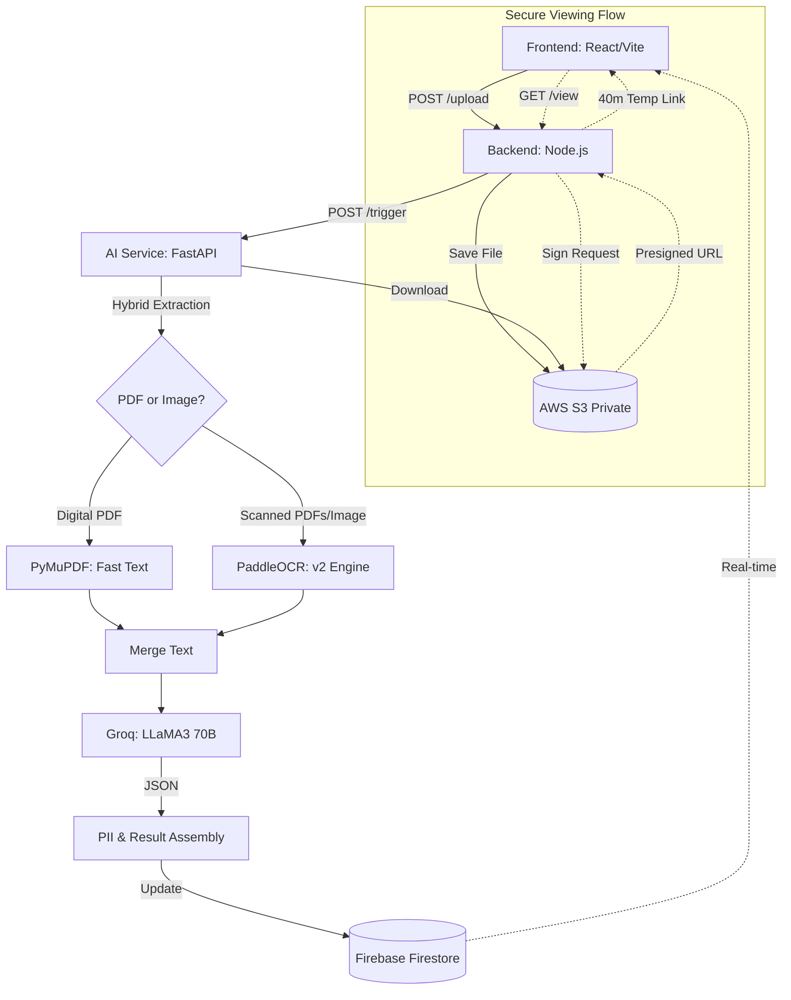

# DocuAI - Intelligent Document Processor 🚀

DocuAI is a professional-grade, multi-service application designed to process identity documents (Passports, ID cards) using a hybrid AI extraction pipeline. It is optimized for high memory-usage tasks like OCR and provides a secure, elegant user experience for document viewing.

---

## 🏗️ Deployment Architecture (Three-Tier Hosting)

The application is deployed across multiple specialized platforms to ensure maximum performance and stability:

| Component | Technology | Hosting Platform | Purpose |
| :--- | :--- | :--- | :--- |
| **Frontend** | React / Vite | **Render (Static)** | High-speed delivery of the user interface. |
| **Backend** | Node.js / Express | **Render (Web)** | Secure orchestration, Firebase management, and S3 signatures. |
| **AI Service** | Python / FastAPI | **Hugging Face** | Heavy AI processing (PaddleOCR, LLaMA3) on **16GB RAM** hardware. |

---

## 🛡️ Secure Document Viewing (S3 Integration)

To solve "Access Denied" errors while keeping your AWS S3 bucket private, the system uses **Pre-signed URLs**:

*   **Secure Access**: Instead of making files public, the backend generates a temporary, encrypted link only when you click "View".
*   **40-Minute Expiration**: For enhanced security and convenience, the generated viewing links are valid for **40 minutes** (`expiresIn: 2400`).
*   **Elegant In-App Modal**: Documents open in a custom-built, glassmorphic Lightbox overlay. This keeps the user within the app experience instead of redirecting to a raw browser tab.

---

## 🚀 Key Features

-   **Hybrid Extraction Pipeline**: Automatically switches between `PyMuPDF` (for digital text) and `PaddleOCR` (for scanned images).
-   **AI Intelligence**: Uses **Groq (LLaMA 3.3 70B)** to extract structured JSON data from unstructured document layouts.
-   **PII Detection**: Proactive identification of sensitive personal information.
-   **Live Sync**: Real-time status tracking via Firebase Firestore.
-   **Startup Stability**: The AI service uses a "Lazy Loading" imports strategy to pass cloud health checks instantly.

---

## 🏗️ Architecture & Data Flow

The system follows a decoupled, event-driven architecture to ensure high performance and reliability.

### System Overview

### How it Works (The Hybrid Pipeline)

1.  **Ingestion & Storage**: Files are uploaded through the React frontend to the Node.js backend, which securely stores them in an **AWS S3** bucket and creates a "Processing" record in **Firestore**.
2.  **Smart Routing**: The AI Service identifies the file type:
    *   **Direct Path**: For digital PDFs, it uses `PyMuPDF` to extract the text layer instantly.
    *   **OCR Path**: For images and scanned PDFs, it triggers the **PaddleOCR** engine (optimized for CPU) to perform a two-pass scan (1100px and 1400px retry) to ensure maximum accuracy for small identity text.
3.  **Semantic Analysis (LLM)**: The raw text is sent to the **Groq Cloud API (LLaMA 3.3 70B)** with a custom prompt tailored for identity documents. The LLM identifies the document type and extracts structured entities (Names, DOB, ID Numbers) into a strict JSON format.
4.  **Privacy Guard**: A regex-based PII service scans the text to identify sensitive patterns independently of the LLM.
5.  **State Sync**: The final intelligence package is written back to Firestore. The React UI, listening via `onSnapshot`, updates instantly to show the results to the user.

---

## 🛡️ Health & Monitoring

-   **Health Checks**: Dedicated `/` and `/health` routes for zero-downtime deployment monitoring on Render and Hugging Face.
-   **Safety Timeouts**: A 5-minute backend listener that auto-fails stalled processes if the AI service crashes due to memory limits (OOM).
-   **"Lazy Import" Fix**: Crucial for Hugging Face deployment stability; ensures the web server responds to mandatory health checks in <1s.
-   **Docker Optimizations**: Models are pre-baked into the image to reduce startup memory spikes and ensure runtime speed.

---

## 🛠️ Tech Stack Details

### AI Service (Python)
- **PaddleOCR**: High-precision text recognition engine.
- **FastAPI**: Non-blocking asynchronous web framework.
- **PyMuPDF**: Ultra-fast digital extraction.

### Backend Server (Node.js)
- **Firebase Admin SDK**: Server-side document state management.
- **AWS SDK v3**: Using `@aws-sdk/s3-request-presigner` for temporary access tokens.

### Frontend (React)
- **Vite**: Modern frontend tooling.
- **Tailwind CSS**: Utility-first CSS framework for custom UI.
- **Framer-style Animations**: Custom CSS animations for modals and skeleton loaders.

---

## 💻 Local Setup
Each service requires its own configuration. See individual directories for details.
- [AI Service Setup](./ai-service/README.md)
- [Backend Setup](./server/README.md)
- [Client Setup](./client/README.md)

### Environment Variables
| Service | Required Keys |
| :--- | :--- |
| **All** | `AWS_ACCESS_KEY_ID`, `AWS_SECRET_ACCESS_KEY`, `AWS_BUCKET_NAME` |
| **Backend/AI** | `FIREBASE_PROJECT_ID`, `FIREBASE_PRIVATE_KEY`, `FIREBASE_CLIENT_EMAIL` |
| **AI Only** | `GROQ_API_KEY` |
| **Backend Only** | `PYTHON_SERVICE_URL` (Points to Hugging Face URL) |

---

## 📝 License
This project is for educational/assignment purposes.
