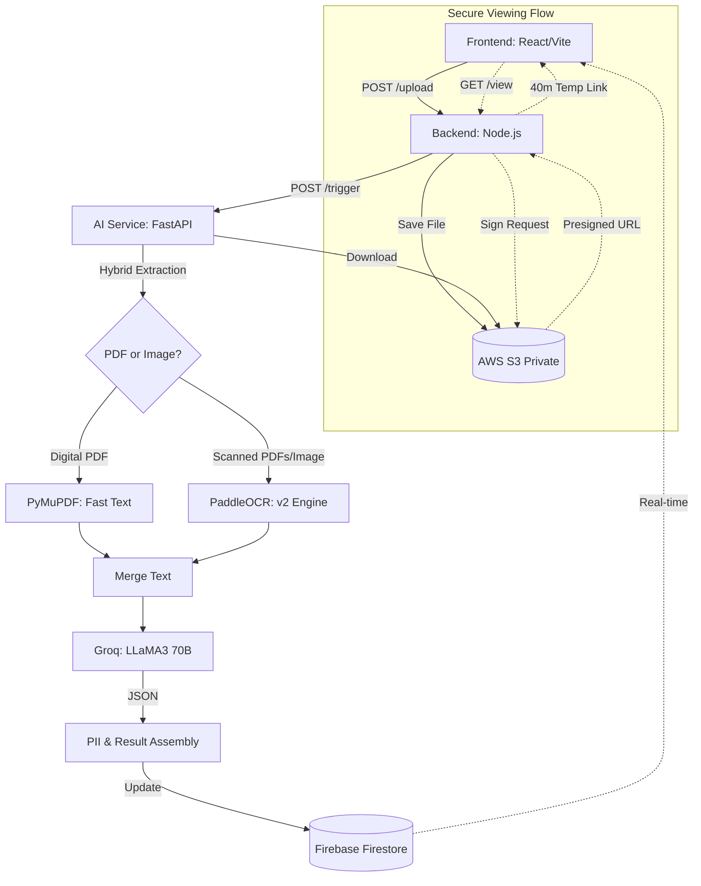

# DocuAI - Intelligent Document Processor 

DocuAI is a professional-grade, multi-tenant application designed to process identity documents (Passports, ID cards) using a hybrid AI extraction pipeline. It features a secure authentication layer, isolated user dashboards, and is optimized for high memory-usage tasks like OCR.

---

##  Authentication & User Isolation

DocuAI uses **Firebase Authentication** and **Firestore Security Rules** to ensure that data is isolated and secure:

*   **Multi-Tenancy**: Every user has their own private dashboard. All uploaded documents are tagged with the user's unique `uid`.
*   **Zero-Trust Backend**: The Node.js server verifies Firebase ID Tokens on every request using `firebase-admin`. Even if an API endpoint is guessed, data cannot be accessed without a valid, fresh token.
*   **Ownership Checks**: The system verifies document ownership at the database level before generating viewing links or triggering AI processing.

---

##  Live Deployment Links

Click the links below to access the production environments of the decentralized services:

| Service | Live URL | Description |
| :--- | :--- | :--- |
| **Frontend UI** | [documentprocessorai-2.onrender.com](https://documentprocessorai-2.onrender.com) | The primary user interface for uploading and viewing documents. |
| **Backend API** | [documentprocessorai-1.onrender.com](https://documentprocessorai-1.onrender.com) | Orchestrates Firebase metadata, AWS S3 storage, and secure signatures. |
| **AI Service** | [aggarwalharshil02-ai-processor.hf.space](https://aggarwalharshil02-ai-processor.hf.space) | High-performance AI extraction & OCR engine on Hugging Face. |

---

##  Verification (Sample Account)

To verify the system's full capabilities without creating a new account, you can use the following credentials:

*   **Email**: `sample@gmail.com`
*   **Password**: `sampleaccount`

**What to expect in the sample account:**
*   **Pre-loaded Results**: 4 sample documents (PDFs and Images) already processed with structured extraction results.
*   **Test Capabilities**: You can click "View" to see the secure presigned URL implementation or upload your own document to see the **Real-time AI Processing** and **PII Detection** in action.

---

##  Deployment Architecture (Three-Tier Hosting)

The application is deployed across multiple specialized platforms to ensure maximum performance and stability:

| Component | Technology | Hosting Platform | Purpose |
| :--- | :--- | :--- | :--- |
| **Frontend** | React / Vite | **Render (Static)** | High-speed delivery of the user interface. |
| **Backend** | Node.js / Express | **Render (Web)** | Secure orchestration, Firebase management, and S3 signatures. |
| **AI Service** | Python / FastAPI | **Hugging Face** | Heavy AI processing (PaddleOCR, LLaMA3) on **16GB RAM** hardware. |

---

##  Secure Document Viewing (S3 Integration)

To solve "Access Denied" errors while keeping your AWS S3 bucket private, the system uses **Pre-signed URLs**:

*   **Secure Access**: Instead of making files public, the backend generates a temporary, encrypted link only when you click "View".
*   **7-Day Expiration**: Optimized for recruitment workflows; generated viewing links are valid for **7 days** (`expiresIn: 604800`) when using IAM credentials.
*   **Elegant In-App Modal (PDF & Image)**: Documents open in a custom-built, glassmorphic Lightbox overlay. Supports high-fidelity rendering for both images (`.jpg`, `.png`) and PDFs.

---

##  How it Works (The Hybrid Pipeline)

The system follows a decoupled architecture using these core logic segments:

1.  **Ingestion & Storage**: Files are uploaded through the React frontend to the Node.js backend. The backend securely stores them in an **AWS S3** bucket and creates a "Processing" record in **Firestore**.
2.  **Smart Routing (OCR vs Text)**: The AI Service identifies if the file is a digital PDF or a scanned image. 
    *   **Digital PDFs**: Direct text extraction using `PyMuPDF`.
    *   **Scanned Documents**: High-precision scanning using the **PaddleOCR** engine (optimized for 1100px base resolution).
3.  **Semantic Analysis (LLM)**: Extracted text is sent to the **Groq Cloud API (LLaMA 3.3 70B)**. The AI identifies the document type and extracts structured entities (Names, DOB, ID Numbers) into a strict JSON format.
4.  **Privacy Guard**: A regex-based PII service independently scans for sensitive patterns (Emails, Phones, SSNs).
5.  **State Sync**: Results are updated in Firestore, and the React UI updates instantly.

---

##  Key Features

-   **Hybrid Pipeline**: Seamlessly handles both digital and scanned files.
-   **PII Detection**: Built-in privacy scanning.
-   **Live Monitoring**: Instant updates via Firebase `onSnapshot`.
-   **Startup Stability**: Uses "Lazy Loading" to ensure $100\%$ uptime during cloud health checks.

---

##  Data Flow Overview (Mermaid Diagram)



---

##  Local Setup & Installation

To run the full suite locally, you need three terminal windows open.

### Prerequisites
- **Node.js**: v16 or higher (v18+ recommended)
- **Python**: 3.10 or higher
- **AWS**: Access keys for an S3 bucket with private settings.
- **Firebase Account**: Project ID and service account credentials.
- **Firestore Index**: A composite index is required for the activity log: `uid` (Asc) + `createdAt` (Desc).

### 1. Clone & Install
```bash
git clone https://github.com/Harshilagg/DocumentProcessorAI.git
cd DocumentProcessorAI
```

### 2. Configure Environment Variables
You must create a `.env` file in each of the three major directories:

#### `ai-service/.env`
```env
AWS_ACCESS_KEY_ID=...
AWS_SECRET_ACCESS_KEY=...
AWS_REGION=...
AWS_BUCKET_NAME=...
FIREBASE_PROJECT_ID=...
FIREBASE_CLIENT_EMAIL=...
FIREBASE_PRIVATE_KEY="..."
GROQ_API_KEY=...
```

#### `server/.env`
```env
AWS_ACCESS_KEY_ID=...
AWS_SECRET_ACCESS_KEY=...
AWS_REGION=...
AWS_BUCKET_NAME=...
FIREBASE_PROJECT_ID=...
FIREBASE_CLIENT_EMAIL=...
FIREBASE_PRIVATE_KEY="..."
PYTHON_SERVICE_URL=http://localhost:8000
```

#### `client/.env`
```env
VITE_API_URL=http://localhost:5001
VITE_FIREBASE_API_KEY=...
VITE_FIREBASE_AUTH_DOMAIN=...
VITE_FIREBASE_PROJECT_ID=...
VITE_FIREBASE_STORAGE_BUCKET=...
VITE_FIREBASE_MESSAGING_SENDER_ID=...
VITE_FIREBASE_APP_ID=...
```

---

### 3. Run the System

#### Terminal 1: AI Service (Python)
```bash
cd ai-service
python -m venv venv
source venv/bin/activate  # Mac/Linux
# .\venv\Scripts\activate # Windows
pip install -r requirements.txt
uvicorn main:app --reload --port 8000
```

#### Terminal 2: Backend Backend (Node.js)
```bash
cd server
npm install
node server.js
```

#### Terminal 3: React Frontend (Vite)
```bash
cd client
npm install
npm run dev
```

The application will be live at `http://localhost:5173`.

---

##  Health & Monitoring

-   **Safety Watchdog**: A 5-minute backend listener auto-fails stalled documents if an OOM crash occurs on low-tier cloud hardware.
-   **Model Baking**: AI models are pre-downloaded in the Dockerfile for near-instant processing once running.
-   **Unbuffered Logging**: Raw output streams configured to bypass cloud log-buffering delays.

---

